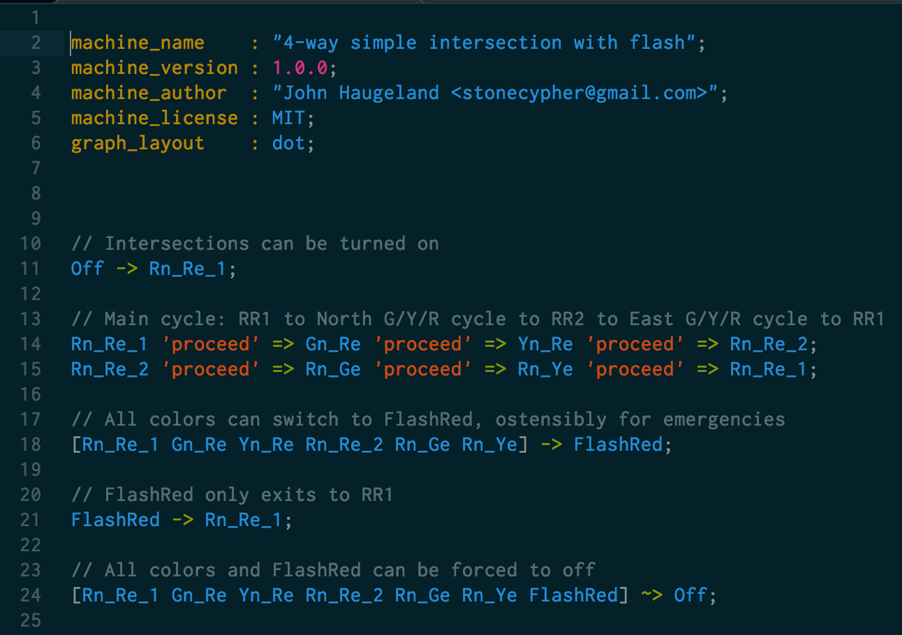

# sublime-fsl

SublimeText highlighter for "Finite State Language" (FSL) 1.0.0

## Is it thorough?

Sublime-FSL covers the complete FSL 1.0.0 language with a well balanced coloring scheme.

## Plugin installation

`Package Control` is the easiest way to install this highlighter, and will manage version changes over time.

To install through Package Control:

* Bring up the command list (`ctrl-shift-P`) and type install package, which should bring up `Package Control: Install Package`. Package Control will pause briefly to fetch the list of available plugins.

  * If you don't see `Package Control: Install Package`, you need to install [Package Control](https://github.com/wbond/sublime_package_control) first.

* When the plugin list appears, type `fsl`.  When you see this package, choose it.

## Current Library Status: *Stable*

This library is considered to be ready and usable, and is available in `Package Control`.

Improvements will be gladly accepted.
